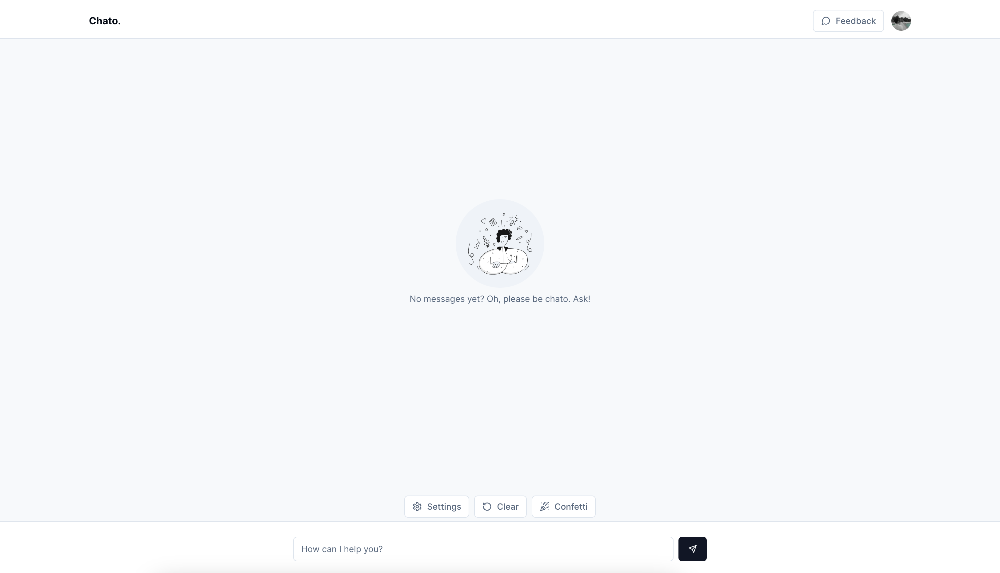

# Chato. An AI Chat Bot.

This is a [Next.js](https://nextjs.org/) to play with AI.

Tech stack used:

- [Next.js](https://nextjs.org/)
- [Tailwind CSS](https://tailwindcss.com/)
- [PNPM](https://pnpm.io/)
- [Vercel](https://vercel.com/)
- [Upstash](https://upstash.com/)
- [Clerk](https://clerk.dev/)
- [Checkly](https://checklyhq.com/)
- [OpenAI](https://openai.com/) (using vercel ai sdk)
- [Shadcn UI](https://ui.shadcn.com/)
- [React Hot Toas](https://react-hot-toast.com/)
- [Zustand](https://zustand-demo.pmnd.rs/)

## Run the project locally

```bash
pnpm dev
```

## Screenshots



## Notes

To generate api key / secrets you can run the following command:

```bash
openssl rand -base64 32
```
